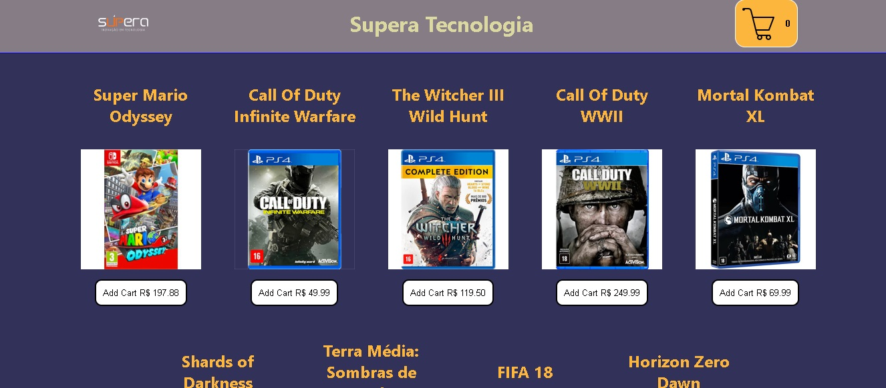

### Tenha instalado em seu computador o node e git preferência a ultima versão para rodar este site

### Faça o download do arquivo em zip:
https://github.com/andre09999/ecommerce-games/archive/refs/heads/master.zip

### Ou faça o gitClone Com o comando:

git clone git@github.com:andre09999/ecommerce-games.git

### Apos estar em sua máquina  rode o comando entre no terminal caso linux ou CMD windows:
 ### `npm install`

### Logo em seguida quando finalizar a instalação das dependência rode o comando:
### `npm start`

### E assim que rodar o comando  você ira ver site pronto no pagina:

### `http://localhost:3000/`

### Tecnologia utilizadas:

### React 18.2.0
### Redux 8.0.5
### Design Responsivo
### Redux-devtools
### react-toastify

### Requisitos executados :
 ###   Feedbacks visuais das ações do usuários ( Mensagem toast e loading no botão de 3s ),
 ###   Requisição em pacote json como Banco de dados,
 ###   Renderezação Dinamica,
 ###   Valores Calculados dinamicamente (subTipo e Total)
 ###   Jogos ao ser adicionados no Carrinho são agrupados por id
 ###   Valores monetários  em Real brasileiro ,
 ###   O usuário poderá adicionar e remover ou alterar a quantidade de produtos do carrinho,
 ###   Renderização condicional
 ###   Design UX e layout baseado no site da Potência tech
### 

